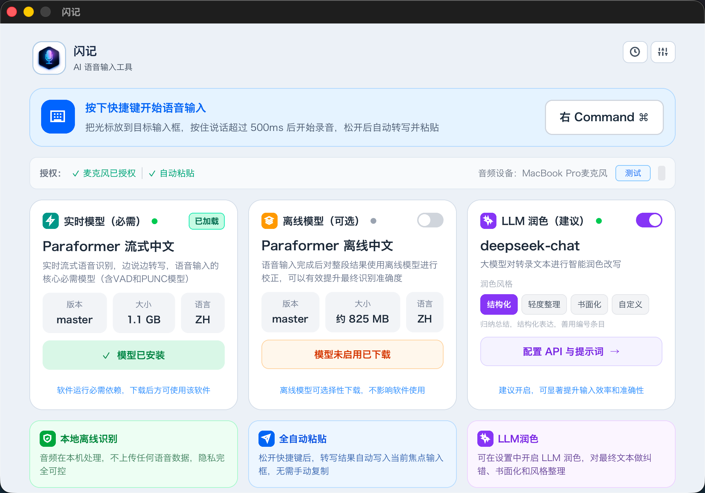

# 闪记 (Shanji)

闪记是一款开源的桌面端 AI 语音输入工具。它通过全局快捷键开始录音，在本地完成语音识别，并可选接入 LLM 对识别结果做轻度整理，最后自动输出到当前光标位置。

它的目标很直接：让你尽量少切应用、少复制粘贴、少做重复整理，把“说话 -> 成文 -> 输入”缩短到一次快捷键操作。




快速入口: [文档](#文档) · [快速开始](#快速开始) · [开发](#开发命令) · [贡献](./CONTRIBUTING.md) · [安全](./SECURITY.md) · [更新记录](./CHANGELOG.md) · [模型工具](./scripts/README.md)

## 核心特性

- 本地实时语音识别
  - 基于 FunASR Paraformer + ONNX Runtime
  - 支持流式转写，适合边说边看结果
  - 音频默认在本机处理，不依赖云端 ASR

- 可选离线二次纠正
  - 支持在识别后使用离线模型做结果修正
  - 适合对最终文本准确率要求更高的场景

- LLM 轻度润色
  - 兼容 OpenAI API 风格接口
  - 支持 OpenAI、DeepSeek、阿里云百炼、月之暗面、智谱 AI、Ollama 等常见服务
  - 提供多种内置提示词预设，如结构化、轻度整理、书面化

- 全局快捷键输入
  - 支持录音开始/停止、按住说话、打开历史、切换润色等快捷操作
  - 以系统托盘方式常驻，减少窗口切换成本

- 自动输出到当前光标
  - 识别完成后可自动粘贴到当前输入框
  - 如果系统权限限制粘贴，会回退为复制到剪贴板
  - 支持中英文标点整理与末尾追加空格/换行

- 历史记录
  - 持久化保存识别结果、润色结果、音频路径等信息
  - 支持查看、复制、删除、回放音频和重新转写
  - 使用 SQLite + FTS5，适合后续扩展搜索能力

- 热词库
  - 内置多个领域词库，例如 AI 编码、计算机、跨境电商、自媒体、网络流行语
  - 支持导入自定义词库
  - 可按词库开关启用或停用

- 原生桌面体验
  - Slint 原生 UI
  - 主窗口、设置窗口、悬浮窗、托盘联动
  - 适合长期后台驻留使用

## 使用场景

- 写消息、邮件、会议纪要
- 记录灵感、笔记和待办
- 技术描述、产品文案、结构化表达整理
- 高频输入场景下减少键盘敲击负担

## 系统要求

- macOS 12.0+
- Windows 10+
- Linux: Ubuntu 22.04 / Debian 12 或兼容发行版

> 说明：仓库当前主开发入口是原生 Rust 桌面应用，实际体验和平台能力会随不同系统权限、音频设备和输入法环境而变化。

## 快速开始

> 本节面向开发者和贡献者。如果你是普通用户，直接从 [Releases](https://github.com/yuhuotech/shanji-app/releases) 下载对应平台的安装包即可，无需安装 Rust 或手动下载模型，应用内可一键完成模型下载。

### 1. 准备环境

- 安装 Rust stable
- 确保系统可以访问麦克风和输入模拟相关权限

### 2. 获取源码

```bash
git clone https://github.com/yuhuotech/shanji-app.git
cd shanji-app
```

### 3. 启动应用

```bash
cargo run -p shanji-app
```

首次启动后，在应用设置页面可以下载所需的语音识别模型。

### 4. 生产构建

```bash
cargo build -p shanji-app --release
```

## 开发命令

```bash
cargo check
cargo test -p shanji-core
cargo test -p shanji-platform
cargo test -p shanji-app
cargo fmt --all
```

## 配置能力

闪记的配置主要覆盖以下几类能力：

- 语音输入
  - 录音模式
  - 麦克风设备
  - VAD 和静音阈值
  - 降噪与音频反馈

- ASR
  - 实时模型选择
  - 离线纠正模型开关
  - 标点风格与句末格式

- LLM 润色
  - 服务商 Base URL
  - API Key
  - 模型名
  - System Prompt
  - 网络代理

- 输出
  - 自动粘贴
  - 剪贴板回退
  - 标点和追加格式

- 快捷键
  - 录音
  - 按住说话
  - 切换润色
  - 打开历史
  - 打开主窗口

## 项目结构

```text
shanji-app/
├── crates/
│   ├── shanji-core/      # 共享核心能力：ASR、LLM、历史、配置、热词、输出等
│   ├── shanji-platform/  # 托盘、快捷键、平台相关能力
│   └── shanji-slint/     # 原生桌面应用入口与 Slint UI
├── docs/                 # 产品、技术设计和开发文档
├── public/               # 模型 registry、默认词表、截图等资源
├── scripts/              # 模型下载、导出和打包工具
└── README.md
```

## 技术栈

- 语言与运行时：Rust
- UI：Slint
- 语音识别：FunASR Paraformer、ONNX Runtime
- 音频：cpal、rodio、hound
- 历史存储：SQLite + FTS5
- 输出模拟：enigo、arboard
- LLM 接入：async-openai

## 文档

- [产品需求](./docs/prd.md)
- [技术设计](./docs/technical-design.md)
- [开发计划](./docs/dev_plan.md)
- [ASR 实现说明](./docs/asr-implementation.md)
- [语音输入后处理](./docs/voice-input-post-processing.md)
- [贡献指南](./CONTRIBUTING.md)
- [更新记录](./CHANGELOG.md)
- [安全策略](./SECURITY.md)

## 参与开发

欢迎提交 issue 和 pull request。

如果你准备扩展这个项目，比较值得优先关注的方向是：

- 更多平台上的输入法和权限兼容性
- 更完整的历史搜索与管理
- 热词库编辑体验
- 模型下载和更新体验
- LLM 润色链路的提示词和可解释性

## 常见问题

### 1. 为什么启动后没有识别结果？

- 确认已在设置页面下载并加载了语音识别模型
- 确认麦克风权限已授予
- 确认当前选择的音频设备正确
- 确认快捷键没有和其他应用冲突

### 2. 为什么自动粘贴失败？

- 系统可能限制了输入模拟或剪贴板访问
- 应用会自动回退为复制到剪贴板
- 可以在设置中检查相关权限与输出行为

### 3. 需要联网吗？

- 本地实时识别本身可以离线运行
- LLM 润色、模型下载和部分网络测试需要联网
- 你也可以完全关闭 LLM 功能，只使用本地 ASR

### 4. 支持哪些输入模式？

- Toggle
- Push-to-Talk

### 5. 这个项目有没有发布版？

- 有，普通用户直接从 [Releases](https://github.com/yuhuotech/shanji-app/releases) 下载安装即可
- 开发者如需自行打包或导出模型，参考 [scripts/README.md](./scripts/README.md)

## 许可证

MIT License，见 [LICENSE](./LICENSE)

## 致谢

- [FunASR](https://github.com/alibaba-damo-academy/FunASR)
- [Slint](https://slint.dev/)
- [ONNX Runtime](https://onnxruntime.ai/)
- [OpenAI API](https://platform.openai.com/)
